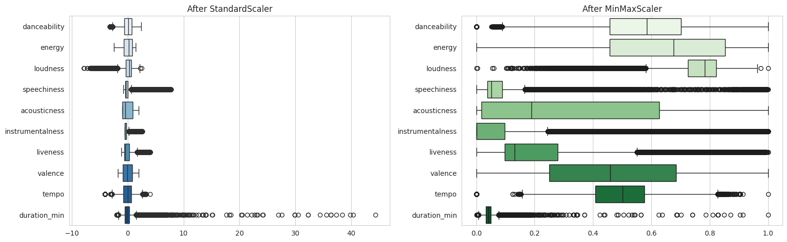

# Spotify Music Recommender & Analysis

End-to-end analysis and content-based music recommendation system using Spotify audio features.

**Goal**: Explore musical characteristics of tracks, discover patterns through clustering, and build a practical recommender that suggests similar songs based on audio features (danceability, energy, valence, tempo, acousticness, etc.).

---

## 🔑 Key Features

- Exploratory Data Analysis of Spotify audio features
- Feature engineering & scaling
- Content-based recommendation using cosine similarity / K-Nearest Neighbors
- Unsupervised clustering for mood / style discovery
- Interactive visualizations
- Simple demo interface (Gradio / Streamlit) for song recommendations

---

## 🛠️ Tech Stack

- **Python**
- **Data & Analysis**: pandas, numpy, scikit-learn
- **Audio / Spotify**: spotipy (or public Kaggle Spotify datasets)
- **Visualization**: matplotlib, seaborn, plotly
- **Optional Demo**: Gradio or Streamlit
- **Notebooks**: Jupyter

---

## 📁 Project Structure

spotify-music-recommender/

├── data/                       # raw / processed datasets (or links)

├── notebooks/

│   ├── 01_data_collection_eda.ipynb

│   ├── 02_feature_engineering.ipynb

│   ├── 03_recommender.ipynb

│   └── 04_clustering_mood.ipynb

├── src/

│   ├── data_loader.py

│   ├── features.py

│   ├── recommender.py

│   └── clustering.py

├── demo/                       # optional Gradio/Streamlit app

├── requirements.txt

├── README.md

└── LICENSE

---

## 🚀 Getting Started

1. Clone the repository
```bash
git clone https://github.com/S33mi/spotify-music-recommender.git
cd spotify-music-recommender
```
2. Create a virtual environment and install dependencies
```
python -m venv venv
source venv/bin/activate   # or venv\Scripts\activate on Windows
pip install -r requirements.txt
```
3. (Optional) Set up Spotify API credentials
Create a .env file with:
```
SPOTIPY_CLIENT_ID=your_client_id
SPOTIPY_CLIENT_SECRET=your_client_secret
```
4. Open the notebooks in order and run them.

---

## 📊 Approach

1. **Data Collection**
    - Spotify Web API via `spotipy` or public Kaggle Spotify datasets

2. **Exploratory Analysis**
   - Distribution of audio features
   - Correlations between danceability, energy, valence, etc.
   - Genre / popularity insights

3. **Feature Engineering**
    - Scaling + optional feature selection

4. **Recommendation**
    - Content-based filtering using cosine similarity on audio feature vectors
    - KNN-based nearest neighbors

5. **Clustering**
    - K-Means / hierarchical clustering to discover natural song groups and mood playlists

---

## 📈 Results & Insights
- [`01_data_collection_eda.ipynb`](https://github.com/S33mi/spotify-music-recommender/blob/main/notebook/01_data_collection_eda.ipynb)
   - Dataset size after cleaning: **(89741, 21)** tracks
   - Most common genres: **k-pop**
   - Features with strongest correlation to popularity: **danceability and loudness**
   - Notable patterns (e.g., high-energy tracks, valence distribution, etc.):
      - Energy and loudness are usually strongly positively correlated
      - Acousticness tends to be negatively correlated with energy and loudness.
      - Valence (positiveness) often shows moderate positive correlation with danceability.
      - Most of avaiable tracks are very unpopuler or have a low play count.

-  [`02_feature_engineering.ipynb`](https://github.com/S33mi/spotify-music-recommender/blob/main/notebook/02_feature_engineering.ipynb)
  - Audio features have different scales (e.g. loudness is in dB, tempo in BPM, others 0-1). We need to scale them before computing distances / similarity.
        

---
<!--
## 🎯 Future Improvements

- Hybrid recommender (content + collaborative filtering)
- User playlist upload & personalization
- Tempo / energy progression analysis
- Integration with playlist optimization project
- Better demo interface

--- -->

## 📄 License
MIT License

**Author:** [S33mi](https://github.com/S33mi/)

Open to Data Analyst / Machine Learning opportunities.
